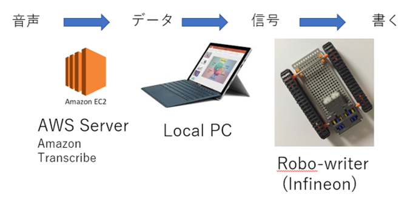

# 自動筆記装置（プロダクト名）

    
イメージ画像が　紹介動画(https://youtu.be/qkqhZMn2rgQ) へのリンクになっています　　

## 製品概要
### Write Tech

### 背景（製品開発のきっかけ、課題等）
少人数のゼミ中にホワイトボードに自動に書き込んでくれるロボットがほしい  
書紀が議論に参加しない  
共有したい  

### 製品説明（具体的な製品の説明）
会話を聞き取って、文字をホワイトボードに書き込む。

### 特長
#### 1. 特長1
音声を聞き取る
#### 2. 特長2
ホワイトボードに書く
#### 3. 特長3

### 解決出来ること
ホワイトボードに書き込まなくていい

### 今後の展望
全自動化　　
音声を聞き取る部分と文字データをロボットの動作に変換する部分が自動化出来なかったので今後は自動化したい。　　  
　
ロボットの小型化と無線化  
よりコンパクトにして普及しやすくする。  

## 開発内容・開発技術
### 活用した技術
音声認識　　
IoT

#### API・データ
今回スポンサーから提供されたAPI、製品などの外部技術があれば記述をして下さい。　　
infineonさん  
１．マイコン　Coretex M0　小型版 *1枚  
２．マイコン　Coretex M0　Aruduino 互換 *2枚  
３．マイコン　Coretex M4　Aruduino 互換 *2枚  
４．3次元磁気センサ*1枚  
７．角度センサ*1枚  
８．モーター駆動用ドライバ*2枚  

#### フレームワーク・ライブラリ・モジュール
* AWS　Amazon Transcribe  
* Arduino IDE

#### デバイス
* 自動筆記装置

### 独自開発技術（Hack Dayで開発したもの）
#### 2日間に開発した独自の機能・技術
* ホワイトボードへの記入ができるロボの制作
