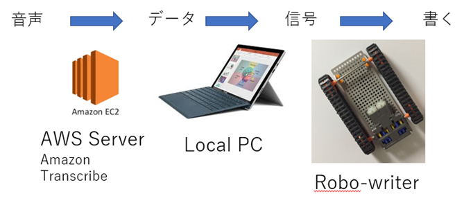

# 自動筆記装置（プロダクト名）

## 製品概要
### Write Tech

### 背景（製品開発のきっかけ、課題等）
少人数のゼミ中にホワイトボードに自動に書き込んでくれるロボットがほしい

### 製品説明（具体的な製品の説明）
会話を聞き取って、文字をホワイトボードに書き込む。

### 特長

#### 1. 特長1
音声を聞き取る
#### 2. 特長2
ホワイトボードに書く
#### 3. 特長3

### 解決出来ること
ホワイトボードに書き込まなくていい

### 今後の展望
全自動化
音声を聞き取る部分と文字データをロボットの動作に変換する部分が自動化出来なかったので今後は自動化したい。

ロボットの小型化と無線化
よりコンパクトにして普及しやすくする。

## 開発内容・開発技術
### 活用した技術
AWS　Amazon Transcribe

#### API・データ
今回スポンサーから提供されたAPI、製品などの外部技術があれば記述をして下さい。

* 
* 
* 

#### フレームワーク・ライブラリ・モジュール
* 
* 

#### デバイス
* 
* 

### 研究内容・事前開発プロダクト（任意）
ご自身やチームの研究内容や、事前に持ち込みをしたプロダクトがある場合は、こちらに実績なども含め記載をして下さい。

* 
* 

### 独自開発技術（Hack Dayで開発したもの）
#### 2日間に開発した独自の機能・技術
* 独自で開発したものの内容をこちらに記載してください
* 特に力を入れた部分をファイルリンク、またはcommit_idを記載してください（任意）
